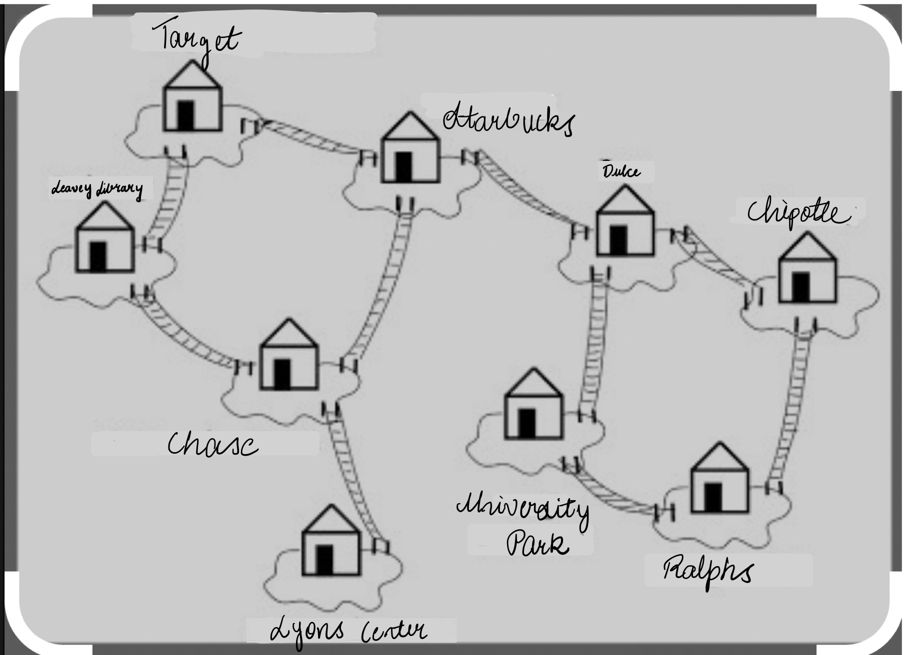
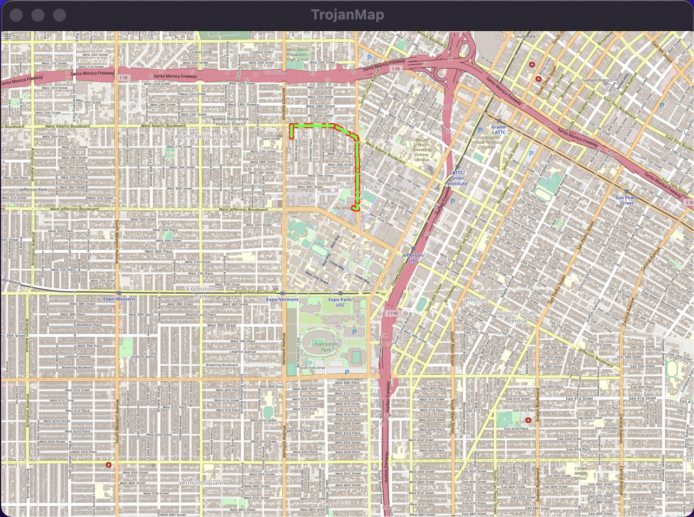
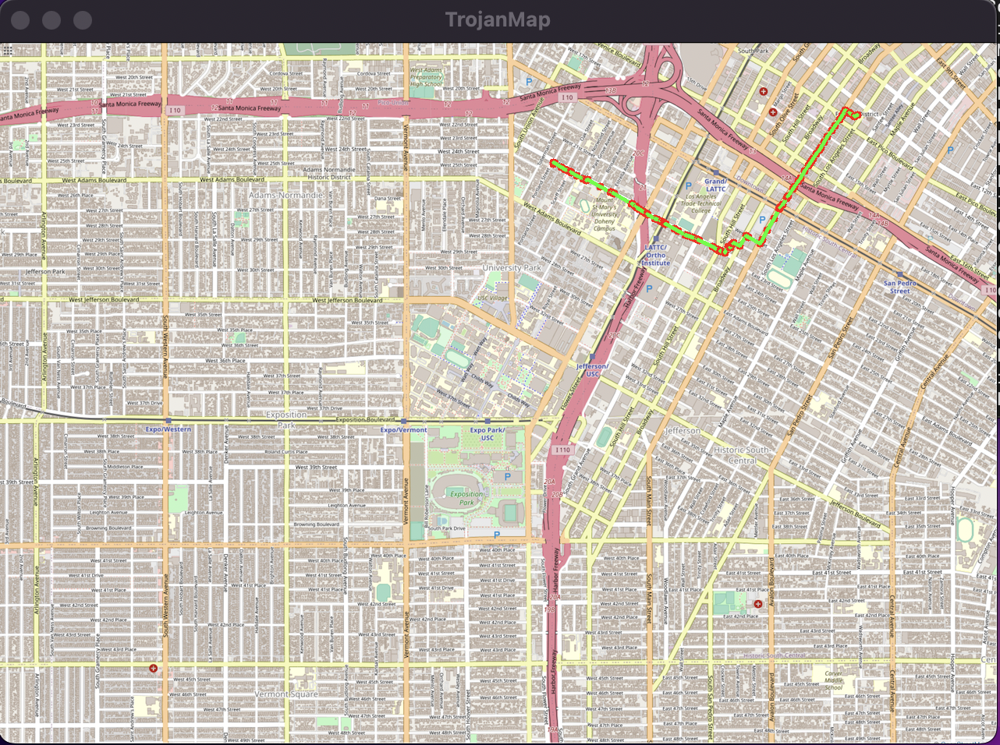
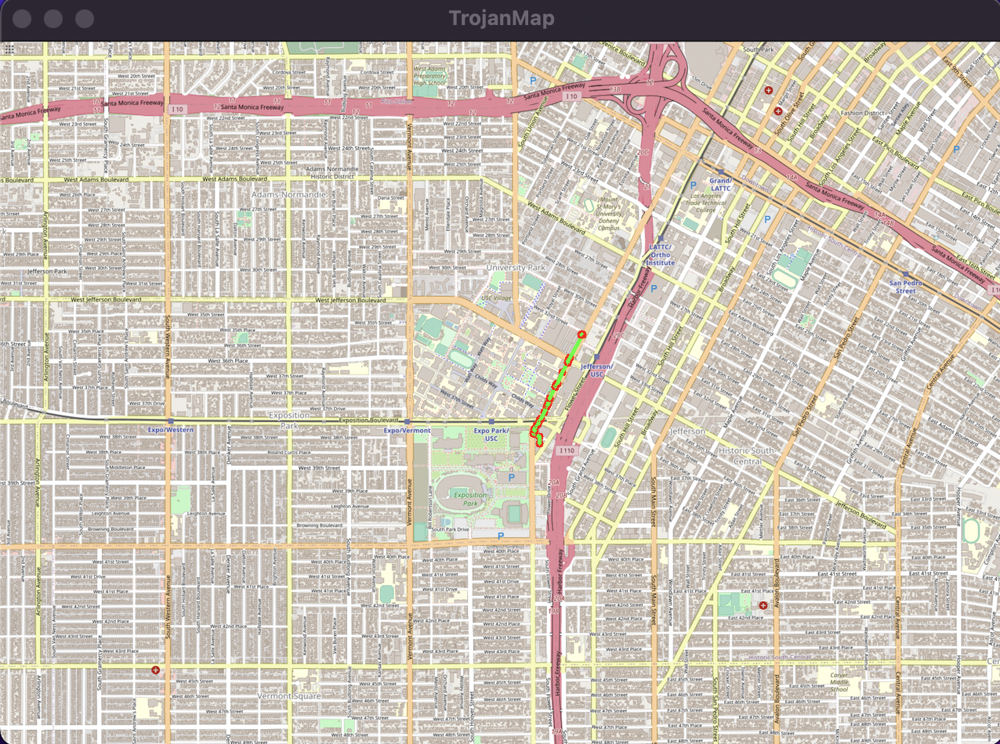
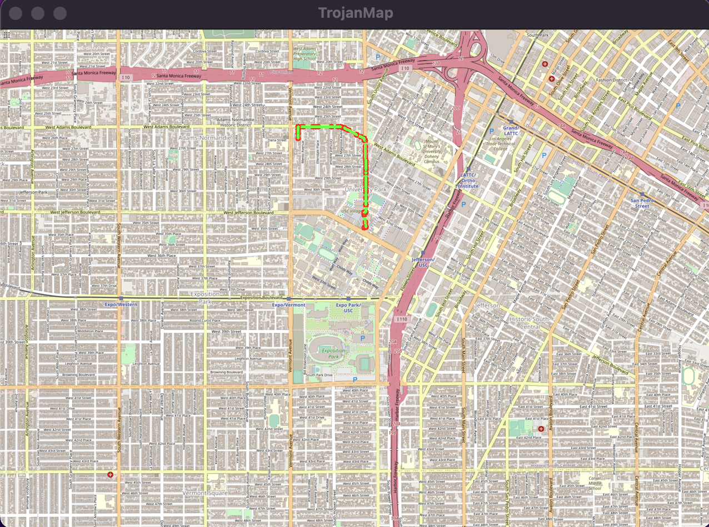
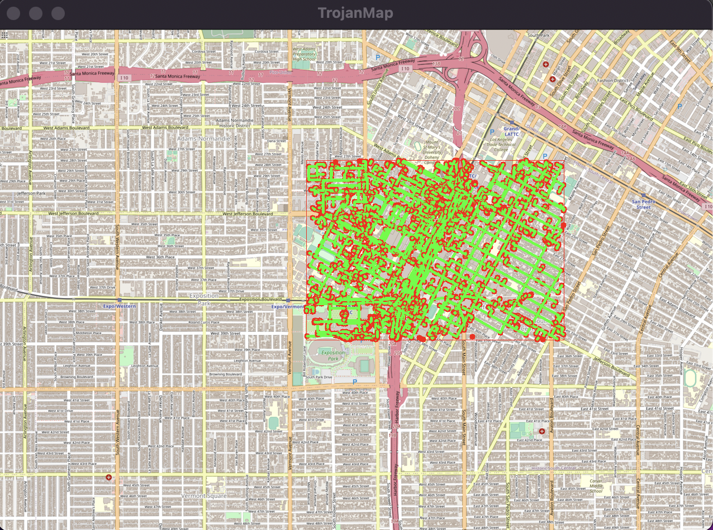
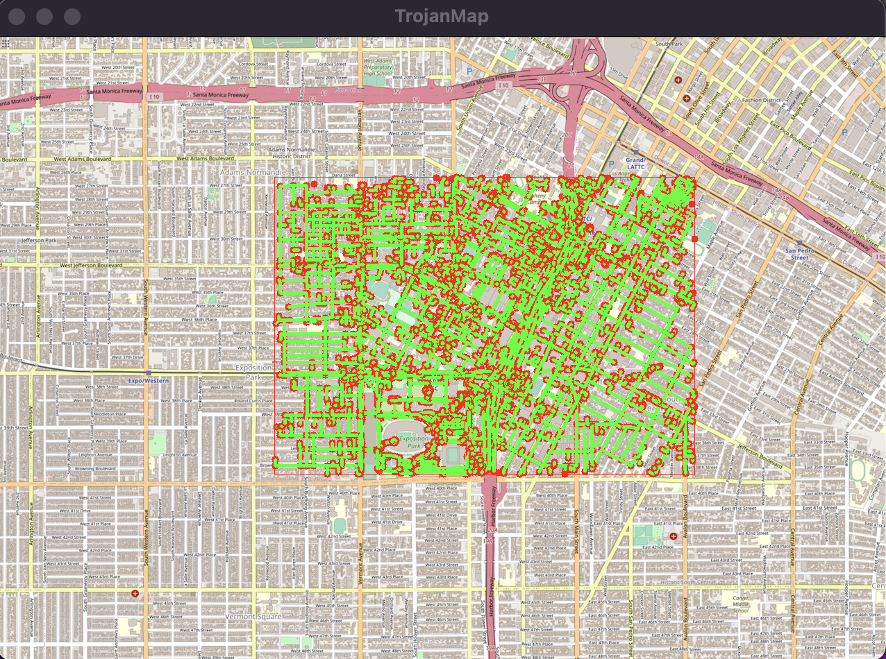
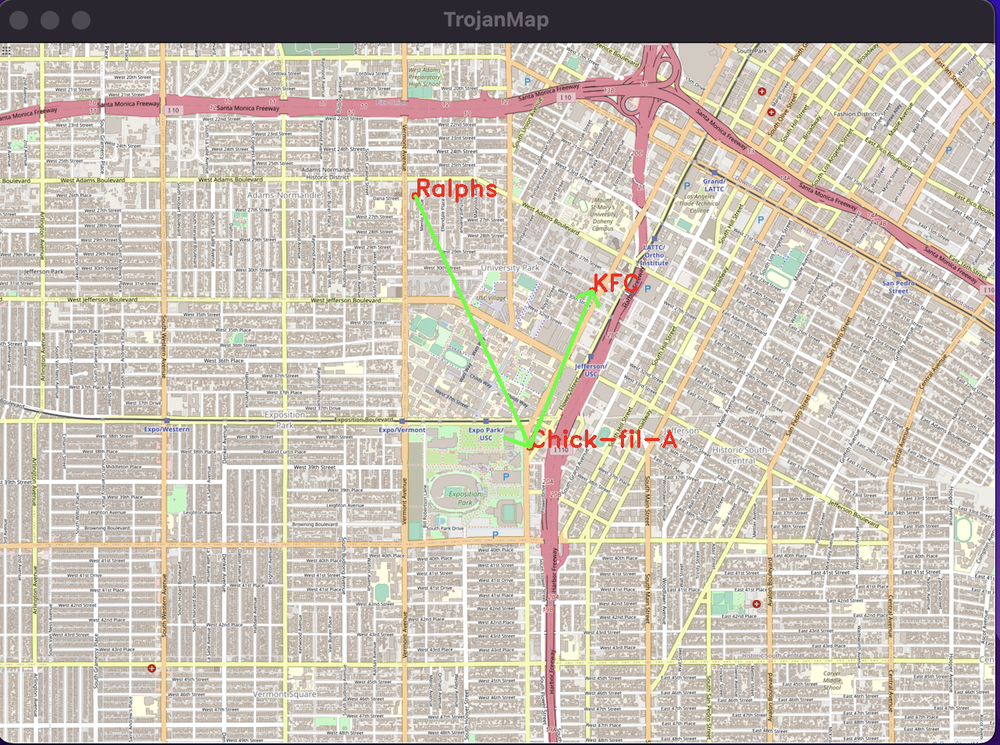
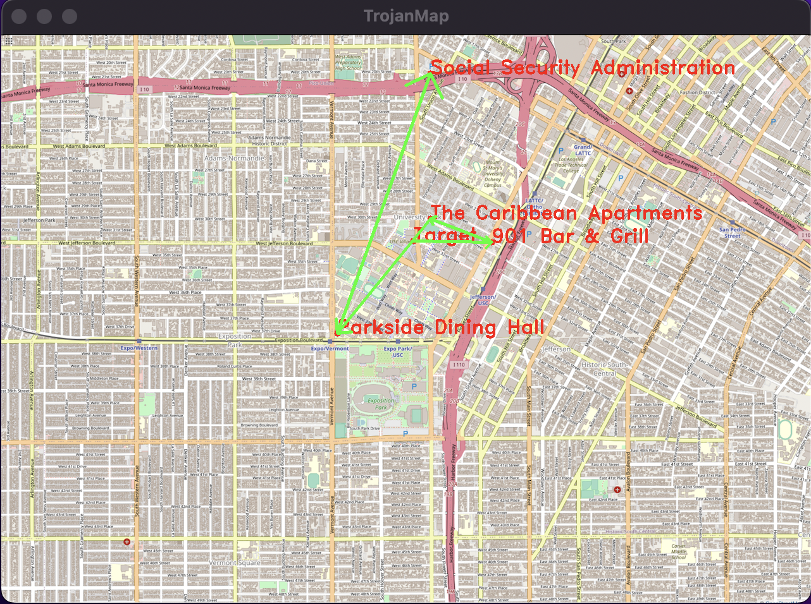
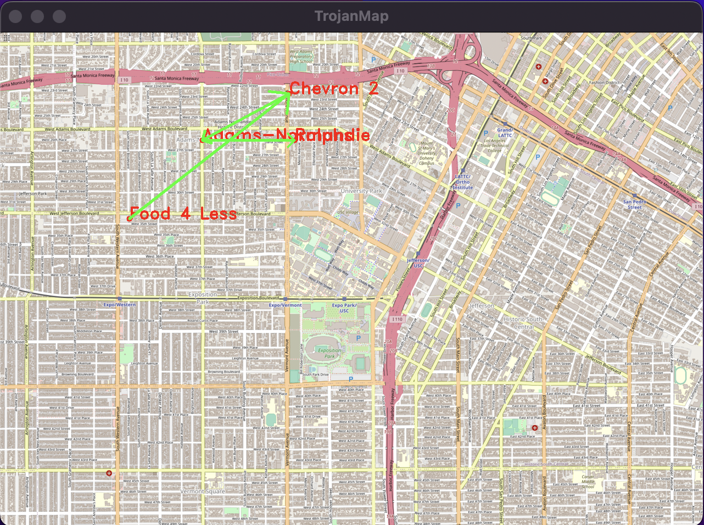

## EE538 Final Project - Spring 2022 - TrojanMap

## TEAMMATES:
## 1. Vaishnavi Channakeshava
## 2. Sanjana Vasudeva

## 1. High-level overview of your design (Use diagrams and pictures for your data structures).

The trojanmap  is an interactive UI map application of the USC campus and its surroundings.  The map has been designed using a graph data structure where each node corresponds to the location.  Each node has a list of features assigned to it - id, latitude, longitude , attributes, and neighbors.  We have implemented various graph algorithms like cycle detection, traveling salesman problem and topological sort. The shortest path between two locations (nodes) has been calculated using two algorithms - Bellman Ford Algorithm and Djikstra Algorithm. Most of the graph algorithms were implemented using depth search first and stack.

Graph Data structure 

## 2. Detailed description of each function and its time complexity. 

 
1. GetLat

The for loop is used to traverse over the data where in we are dereferencing the iterator to get the first member (Key) and we are extracting the id of the node(location) of that correspoding key. We compare the id given as the input to the function against the id we have extracted for each iteration. If the ID's are equal then we extract the third element of the Node which is the latitude.

2. GetLon

The for loop is used to traverse over the data where in we are dereferencing the iterator to get the first member (Key) and we are extracting the id of the node(location) of that correspoding key. We compare the id given as the input to the function against the id we have extracted for each iteration. If the ID's are equal then we extract the third element of the Node which is the longitude.

3. GetName

The for loop is used to traverse over the data where in we are dereferencing the iterator to get the first member (Key) and we are extracting the id of the node(location) of that correspoding key. We compare the id given as the input to the function against the id we have extracted for each iteration. If the ID's are equal then we extract the fourth element of the Node which is the name.

4. GetID

The for loop is used to traverse over the data where in we are dereferencing the iterator to get the first member (Key) and we are extracting the name of the node(location) of that correspoding key. We compare the name given as the input to the function against the name we have extracted for each iteration. If the name's are equal then we extract the first element of the Node which is the ID.

5. GetNeighborIDs

The for loop is used to traverse over the data where in we are dereferencing the iterator to get the first member (Key) and we are extracting the id of the node(location) of that correspoding key. We compare the id given as the input to the function against the id we have extracted for each iteration. If the ID's are equal then we extract the third element of the Node which is neighbors.

6. Autocomplete

The input to the function Autocomplete name which is a partial name is converted to lower case to avoid any discrepancy. The for loop is used to traverse over the data where in we are dereferencing the iterator to get the first member (Key) and we are extracting the name of the node(location) of that correspoding key and creating a copy of the name extracted. The copy of the name is also converted to lower case and this is compared against the partial name converted to lower case, if the partial string is at found at the zeroth index of the name (i.e the partial name is the prefix), then the location name is pushed into a vector. The vector containing the list of all names which has the partial name as prefix is returned. 

7. GetPosition

First the id corresponding to the given name is extracted using the GetID function. If the Id obtained is an empty string then a default pair is returned with latitude and longitude set to -1 else we get the latitude and logitude using the GetLat and GetLon function for the corresponding id and assign it to the first and second element of the pair and return the pair
 

8. CalculateEditDistance

A 2D array of size - (m+1)x(n+1) is created, where m = length of string1 and n = length of string2. A element of the 2D array at the ith, jth position D[i, j] = edit distance between length-i prefix of x and length-j prefix of y. A value in a cell depends upon its upper, left, and upper-left neighbors.
We have initialized D[0, j] to j, D[i, 0] to i. Then we fill the remaining cells from top row to bottom and from left to right.Then start from the end and choose the path which has a predecessor of minimum value.

The time complexity of the function is O(mn).

9. CalculateShortestPath_Dijkstra

The main goal of Dijkstra's algorithm is to find the shortest path between nodes in a graph. Firstly, we get the start and end node from the given location names. We create a min heap using priority queue with the pair <distance,node ID>. Next we use three unordered maps to store the shortest distance of each node, to save the predecessor, to save the visited nodes. We initialize all the id values of the shortest distance map to, all the id values of the predecessor map to empty string and set visited to false. The start node is then added to the min-heap. We use the while loop to find the shortest path using the predecessor map by removing the node from the min-heap and update the map until the destination node is found or until the heap is empty.

Time taken by function: 107 ms

Time Complexity : O((M + N)log(N))

Dijkstra path from Ralphs to Target

Dijkstra path from 23rd Street Cafe to Fashion District

10. CalculateShortestPath_Bellman_Ford

The Bellman_Ford algorithm implementation is again used to find the shortest path between nodes in a graph. Firstly, we get the start and end node from the given location names. Here, we use two unordered maps to save the shortest disstance and to save the predecessor of each node. We initialize all the ids of the distance to infinity, and that of the predecessor maps to empty string. We do not use min heap in the Bellman Ford algorithm. We traverse through the data map to calculate the new distance of each neighbor node. We then update the neighbor's shortest distance by comparing it with the previous distance. If the shortest distance to end point exists we build the path using the predecessormap.

Time Complexity : O(V+E) V - Vertices and E - Edges on the map

Shortest path from Chipotle to CVS Pharmacy using Bellman Ford Algorithm. 

Shortest path from Rock & Reillys to Ralphs using Bellman Ford Algorithm. 

Runtime comparison of the two algorithms for different examples.

11. ReadLocationsFromCSVFile

The function ReadLocationsFromCSVFile takes CSV filename as the input, reads it and parse the locations data from CSV file. The locations name is appended to the vector which in turn is used for the topological sort problem.

Time Complexity : O(N)

12. ReadDependenciesFromCSVFile

The function ReadDependenciesFromCSVFile takes CSV filename whic has the source and ddestination names as the input, reads it and parse the dependencise data from CSV file. We create a vector of two strings i.e the source and destination. This vector pair is appendend to another vector which in turn is used for the topological sort problem.

Time Complexity : O(M*N)

13. GetSubgraph

This function takes four vertexes of the square area as the input and returns the list of location ids in the square. We traverse through the data map to extract the latitude and longitude. If the latitude and longitude lies between the given vertices then we append the corresponding location ids to the subgraph vector we created.

14. hasCycle

We initially set the current node as true in visited map. NExt we traverse the current node’s neighbor nodes and record current node as predecessor node of these neighbor nodes. If neighbor is in area and is unvisited we do recursive function and if the final recursive returns true it indicates a cycle exits in the graph and thus we return true, else if it is visited and it's not the parent node indicares there is a cycle in the graph and we return true. Else, if both the conditions fail it indicates there is no cycle and we return false.

15. CycleDetection

This function takes the four points of the square subgraph as input and returns true if there is a cycle path inside the square. We traverse all the nodes in the map. If the node position is in the square, add the pair in visited map. Next, we traverse all nodes in the visited map. If the node has not been visited, go to the hasCycle function. If hasCycle function returns true, we then use predecessor map to plot a cycle and return true.

Time Complexity : O(N) 

Example 1 : Cycle detected for the given four points of the square-shape subgraph.

Example 2 : Cycle detected for the given four points of the square-shape subgraph.

16. Topologicalsort_helper

The Topologicalsort_helper is a recursive function. The visited map is updated to true for the given location. Next, the list of adjacent locations is obtained from the directed a-cyclic graph. We iterate over this list and if the location has not been visited we call the helper function recursively on this function. Next, we update the stack with the location given to the helper function.

Time Complexity : O(N)

17. DeliveringTrojan

This function creates directed a-cyclic graph using dependecies vector. To keep track of the id visited we use a visited map with string a boolean as the pair wherein the boolean value is set to false initially for all the points in the location vector. We also create a stack to store the locations that are visited. The helper function is invoked if the location is not visited. Next, the contets of the stack is pushed to the resulting vector.

Time taken by function: 0 ms

Time Complexity : O(M*N)

Topological sorted path of Ralphs to Chick-Fil-A to KFC

Topological sorted path of Target to 901 Bar & Grill to The Caribbean Apartments to Parkside Dining Hall to Social Security Administration

Topological sorted path of Food 4 Less to Chevron 2 to Adams-Normandie to Ralphs

18. Travelling Salesman Problem - Brute Force

Given a list of locations, the algorithm returns the shortest path which visit all the places and back to the start point. The algorithm takes the permutation of all possible paths possible and returns the shortest path. Initially we set the minimum cost to DBL_MAX. We recursively calculate the cost and keep updating the min_cost, cur_cost of the paths along with simultaneously updating the result. If the previous distance is bigger than the current distance we push the current path. We proceed until we get the best path.

Time Complexity : O(n!)

19. Travelling Salesman Problem - Backtracking

Initially we set the minimum cost as DBL_MAX. The algorithm takes the permutation of all possible paths possible and returns the shortest path as the result. We recursively call the TSP helper function to keep updating the min_cost, cur_cost of the paths along with simultaneously updating the result. In this algorithm as soon as the current path cost excceds the previous path cost we break out of the loop and further continue with running the DFS for the next path. The algorith is run until the best path is achieved. 

Time Complexity : O(n!)

20. Travelling Salesman Problem - 2 Opt Heuristic

The algorithm randomly swaps between two nodes of the path and is continued for certain number of iterations while there is improvement. This is done to avoid path crossing. Initially we set the minimum cost as DBL_MAX. The algorithm finds a new path on every iteration until we find the improved path. If the new path length is better than a previous path we will push them into the results.

Time Complexity : O(n*k) where k is the number of improvements possible

Runtime comparison of the three TSP algorithms

21. Find Nearby 

The algorithm returns a list of k locations closest to the name of interest within the radius r in increasing order of distance. In this function we create a map with the keys which stores the distance between the current id and the given id and the value is the corresponding current id. The distances are stored in the descending order in the map. We iterate over the entire data, if the attribute of the current location matches the given attribute to the function, then the distance between the current id and the current id are pushed to the map. The reversed list of ids created from the map is returned.

Time Complexity: O(n)

22. Travelling Salesman Problem - 3 Opt Heuristic (Extra Credit)

## 3. Time spent for each function.

In this section we compute the time spent for each function.

1. Autocomplete : The time taken by the function to execute and give the result is approximately 22-29ms.

2. Find the location : The time taken by the function to execute and give the result is approximately 16ms.

3. Calculate shortest distance - Dijkstra Algorithm : Average Time taken by function is 94 ms.

4. Calculate shortest distance - Bellman-Ford Algorithm : Average Time taken by function is 8798 ms.

5. Travelling Salesman Problem - Brute-Force : 

6. Travelling Salesman Problem - Backtracking :

7. Travelling Salesman Problem - 2-Opt Heuristic :

8. Cycle Detection : Average Time taken by function is 8798 ms.

9. Delivering Trojan : Average Time taken by function is 8798 ms.

10. Find Nearby : Average Time taken by function is 8798 ms.

## 4. Discussion, conclusion, and lessons learned.

Through this project we got to increase our knowledge about various data structures by implementing a variety of algorithms. By building this project from the roots, we have had the unique opportunity to gain hands-on experience with the c++ frameworks, allowing us to develop concrete proficiency in C++ and data structures. 

We worked on the graph data structure to represent the map and implemented algorithms on that. Most importantly, after the initial release of the project's assignment, the course structure evolved to guide us through a variety of algorithmic concepts such as Dijkstra, Bellman-Ford, 2-opt for TSP, Cycle Detection and Topological Sort, all of which can be considered cornerstones of the theory of algorithms in Computer Science.